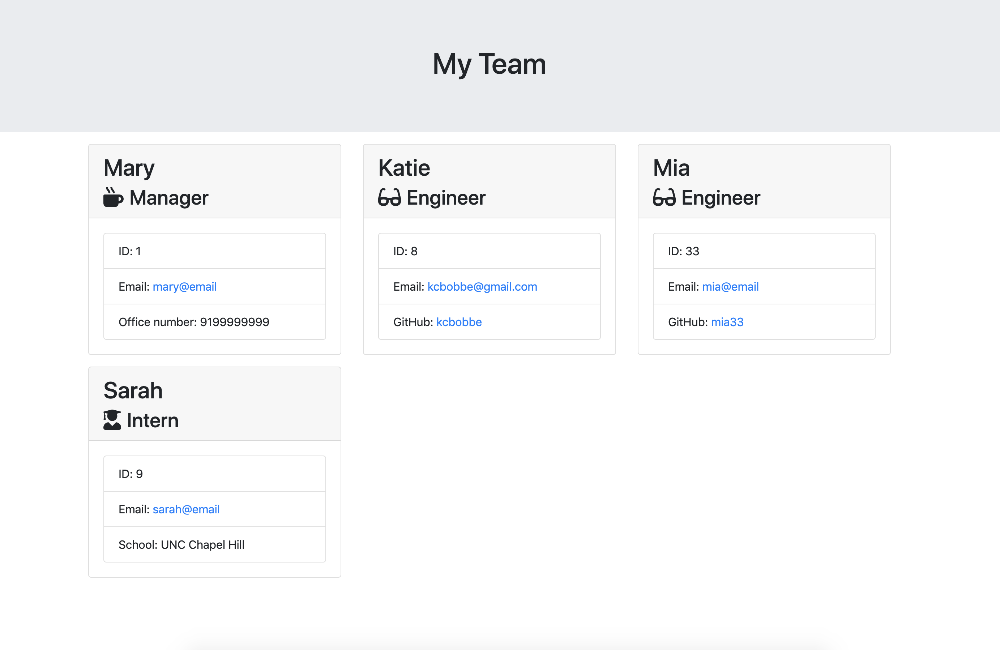

# Employee Template
## Use a CLI to create visualizations of employee information

## Table Of Contents
1. Description
2. Technologies Used
3. Installation
4. Usage
5. Contributors
6. Questions
7. Credits

## Description
Use the interactive CLI to create a visualization of employees in your workplace. Answer step by step questions to quickly create new employee profiles. There are specialized profiles available for interns, engineers, and managers.

## Technologies Used
* inquirer
* jest
* JavaScript
* Node.js
* HTML

## Installation
1. Clone the respository from GitHub
2. Naviagate to the project directory, then run npm install to install dependencies for the project

## Usage
1. In the terminal, navigate to the project directory then type 'node index.js'.
2. Answer the questions in the CLI. You will be promted to choose an employee type, then fill out personal information for the employee. Continue to add as many employees as wanted.
3. A team.html file will be created in the output folder in your directory. View that file in your browser to see a visualization of your team members.

## Contributors
1. Katie Bobbe
2. Template files from instructor

## Questions
1. What are some ways that the visual representation of employee data can be enhanced?
2. Is there other information that could be collected through the CLI to make the employee profiles more complete?

## Credits 
1. Inquirer.js documentation: https://www.npmjs.com/package/inquirer